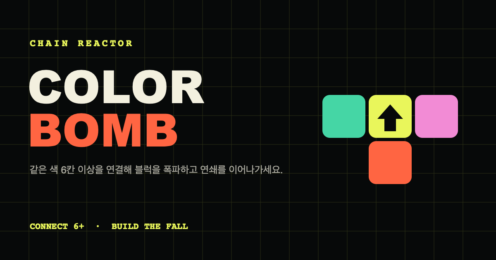

# COLOR BOMB



같은 색 6칸 이상을 연결해 블럭을 폭파하고 연쇄를 이어나가는 모바일 중심 퍼즐 액션 게임입니다.

**Play:** https://color-tetrix-aimho.web.app/

## v0.4.0 변경 내용

- 앱 이름을 `COLOR BOMB`으로 변경하고 웹, PWA, 공유 이미지와 Capacitor 설정을 통일했습니다.
- 같은 색 6칸 제거 규칙은 유지하면서 연결 예고, 제거 점수와 연쇄 보너스 피드백을 강화했습니다.
- 조각 고정 시간을 0.5초로 늘리고 월킥, 화살표 동반 회전과 모바일 드래그 조작을 개선했습니다.
- 리액터를 자동 발동 방식으로 바꾸고, 터치한 연결 색상 영역을 여러 번 바꿀 수 있도록 재설계했습니다.
- 레벨이 오를수록 리액터 충전 효율과 지속 시간이 감소하도록 난이도를 조정했습니다.
- 데일리 모드와 화면 하단 조작 버튼을 제거하고 튜토리얼과 게임 문구를 정리했습니다.
- 점수 기록을 기기 내 TOP 50으로 전환하고 Firestore의 공개 읽기·쓰기를 차단했습니다.
- 게임 영역 전체에 블럭 색상 그라데이션 테두리와 리액터 전용 애니메이션을 추가했습니다.

## 핵심 규칙

- 10 × 20 보드에서 기본 테트로미노 7종을 사용합니다.
- 잠긴 조각은 개별 색상 셀로 분리됩니다.
- 같은 색 셀 6개 이상이 상하좌우로 연결되면 동시에 제거됩니다.
- 제거 후 각 열에 중력이 적용되며, 새 연결이 생기면 연쇄가 이어집니다.
- 줄 완성만으로는 블록이 사라지지 않습니다.
- 다음 조각이 생성될 공간이 없으면 게임이 종료됩니다.
- 조각이 바닥에 닿은 뒤 0.5초 동안 이동·회전할 수 있습니다.
- 현재 조각으로 같은 색이 4개 이상 연결되면 보드 셀의 윤곽이 단계적으로 강조됩니다.

## 주요 기능

### 색상 조각과 연쇄

- 한 조각 안에 여러 색이 포함되는 기본 조각
- 5% 확률로 등장하는 단색 조각
- 단색 조각이 8개 동안 나오지 않으면 다음 조각에서 보장
- 삭제 셀 수와 연쇄 단계에 따른 점수 배수
- 삭제량에 따라 강화되는 파편, 화면 충격 및 사운드 연출

### 화살표 이벤트

10% 확률로 조각의 한 셀에 방향 화살표가 부여됩니다. 화살표 셀이 색상 연결 또는 다른 화살표 효과로 제거될 때 발동합니다.

- `↑`: 바로 위 행 전체 제거
- `↓`: 바로 아래 행 전체 제거
- `←`: 바로 왼쪽 열 전체 제거
- `→`: 바로 오른쪽 열 전체 제거
- 제거된 행·열에 다른 화살표가 있으면 연속 발동
- 전체 행·열을 가로지르는 점화 빔과 강화된 파편 연출

### Reactor

블록 제거로 내부 충전이 완료되면 Reactor가 자동으로 발동합니다. 기본 6칸 제거는 9%를 충전하고 연쇄 단계마다 보너스를 얻으며, 레벨이 오를수록 충전 효율은 100%에서 45%까지, 유효 시간은 5초에서 3초까지 감소합니다. 평소에는 충전 UI를 표시하지 않습니다.

- 자동 낙하와 일반 조작 일시 정지
- 쌓인 블록을 여러 번 터치해 연결된 같은 색 영역을 무작위 단색으로 변경
- 종료 후 색상 제거, 연쇄, 중력을 한 번에 처리
- 중앙 카운트다운, 과부하 화면 효과, 전용 배경음 적용
- 최초 발동은 첫 색상 그룹을 직접 터치할 때까지 카운트다운 정지

### 점수와 이벤트

- 연쇄 점수 배율은 `×1 / ×1.8 / ×3 / ×4.8 / ×7`로 상승합니다.
- 방향 화살표 조각은 10% 확률로 등장하며, 16개 연속 미등장 시 다음 조각에서 보장됩니다.
- 튜토리얼은 이동, 6개 연결, 제거, 리액터 터치를 미니 보드 애니메이션으로 보여줍니다.

### 플레이 진행

- 삭제 30셀마다 레벨 상승, 최대 레벨 20
- 레벨에 따라 낙하 속도, 잠금 유예, 배경음 긴장도 상승
- 최고 레벨에 따라 `STANDARD`, `RAPID`, `EXPERT` 페이스 적용
- 누적 삭제 500셀에서 `EMBER`, 2,000셀에서 `AURORA` 테마 해금
- 프로필과 선택 테마는 브라우저에 저장

### 기기 내 기록

- 기기별 TOP 50 점수 기록
- 플레이어 이름을 브라우저에 기억
- 외부 계정이나 서버 전송 없이 브라우저에 저장

### 모바일 및 오디오

- 모바일 화면에서 정사각 셀 비율을 유지하며 보드 공간 최대화
- iOS Safari 오디오 세션 및 Web Audio 잠금 해제 처리
- 레벨에 따라 속도와 밀도가 변하는 절차적 배경음
- 핀치 및 더블 탭 화면 확대 방지
- 첫 플레이에서 기기별 조작 튜토리얼 제공
- PWA 매니페스트와 오프라인 앱 셸 제공

## 조작법

### 모바일

| 입력 | 동작 |
| --- | --- |
| 보드 탭 | 조각 회전 |
| 좌우 드래그 | 조각 실시간 이동 |
| 아래 드래그 | 천천히 내리기 |
| 빠른 아래 스와이프 | 한 번에 내리기 |
| 위 스와이프 | 조각 보관 |
| 리액터 발동 중 색상 그룹 터치 | 해당 연결 영역 색상 변경 |

### 데스크톱

| 키 | 동작 |
| --- | --- |
| `←` / `→` | 좌우 이동 |
| `↓` | 천천히 내리기 |
| `↑` / `W` / `X` / `Z` | 회전 |
| `Space` | 한 번에 내리기 |
| `Shift` / `C` | 조각 보관 |

O 조각도 형태는 유지한 채 내부 색상과 이벤트 기호가 회전합니다.

## 기술 구성

- Vanilla JavaScript
- HTML Canvas 2D
- Vite 7
- Firebase Hosting
- Web Audio API
- Service Worker / Web App Manifest
- Capacitor 7 패키징 설정
- Node.js 내장 테스트 러너

## 로컬 실행

### 요구 사항

- Node.js 22.12 이상
- npm

```bash
npm install
npm run dev
```

개발 서버는 기본적으로 `http://localhost:5173`에서 실행됩니다.

## 테스트와 빌드

```bash
npm test
npm run build
npm run preview
```

테스트는 입력, 오디오, 난이도, 조각 생성, 화살표 효과, 음악, 기기 내 점수 기록 및 진행 시스템을 검증합니다.

## Firebase 배포

Firebase CLI에 로그인하고 프로젝트 접근 권한이 있는 상태에서 실행합니다.

```bash
firebase deploy --only firestore,hosting --project color-tetrix-aimho
```

`npm run deploy`도 Hosting과 Firestore의 차단 규칙을 함께 배포합니다. 현재 게임 데이터는 기기 안에만 저장되며 Firestore 클라이언트 접근은 허용하지 않습니다.

관련 설정 파일:

- `firebase.json`
- `firestore.rules`
- `firestore.indexes.json`
- `.firebaserc`

## 네이티브 앱 패키징 준비

Capacitor 설정은 포함되어 있지만 iOS 및 Android 스토어 바이너리는 아직 생성하거나 배포하지 않습니다.

```bash
npm run cap:add:ios
npm run cap:add:android
npm run cap:sync
```

스토어 제출 전에는 각 플랫폼의 개발자 계정, 앱 서명, 아이콘 및 심사 메타데이터가 추가로 필요합니다.

## 프로젝트 구조

```text
src/
├── main.js          # 게임 루프, 렌더링, 입력 및 UI 흐름
├── events.js        # 화살표 행·열 제거와 연속 발동
├── pieces.js        # 단색 및 이벤트 조각 생성
├── progression.js   # Reactor, 프로필과 페이스
├── difficulty.js    # 레벨, 낙하 속도와 연출 강도
├── audio.js         # 모바일 및 Safari 오디오 호환
├── music.js         # 절차적 배경음
├── input.js         # 키보드와 모바일 입력 판정
├── leaderboard.js   # 기기 내 TOP 50 점수 기록
├── pwa.js           # Service Worker 등록
└── style.css        # 반응형 게임 UI

test/                # Node.js 단위 및 회귀 테스트
public/              # 아이콘, OG 이미지, 매니페스트, Service Worker
```

## 현재 범위

구현된 범위는 싱글 플레이 Endless 모드입니다. 멀티플레이, 아이템, 특수 블록 확장, 앱스토어 출시는 현재 포함하지 않습니다.
