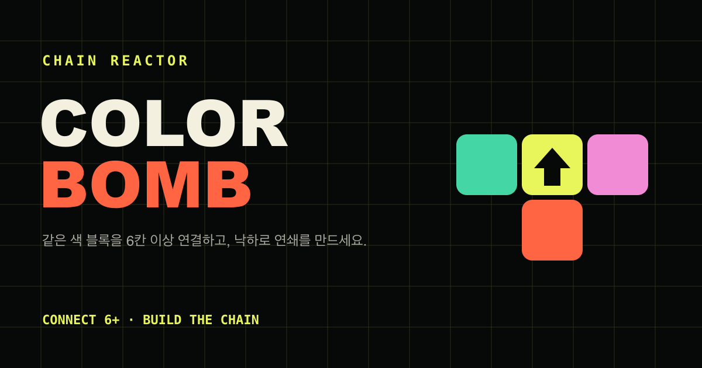

# COLOR BOMB



같은 색 블록을 6칸 이상 연결해 폭발시키고, 낙하로 연쇄를 만드는 모바일 중심 퍼즐 액션 게임입니다.

**Play:** https://color-tetrix-aimho.web.app/

## v0.4.0 변경 내용

- 앱 이름을 `COLOR BOMB`으로 변경하고 웹, PWA, 공유 이미지와 Capacitor 설정을 통일했습니다.
- 같은 색 6칸 제거 규칙은 유지하면서 연결 예고, 제거 점수와 연쇄 보너스 피드백을 강화했습니다.
- 조각 고정 시간을 0.5초로 늘리고 월킥, 화살표 동반 회전과 모바일 드래그 조작을 개선했습니다.
- 리액터를 자동 발동 방식으로 바꾸고, 제한 시간 동안 색상 폭발에 화살표를 추가하도록 재설계했습니다.
- 레벨이 오를수록 리액터 충전 효율과 지속 시간이 감소하도록 난이도를 조정했습니다.
- 리액터는 직접 색상 연결 제거로만 충전되며, 리액터 중 화살표 제거는 재충전되지 않습니다.
- 데일리 모드와 화면 하단 조작 버튼을 제거하고 튜토리얼과 게임 문구를 정리했습니다.
- Firebase 익명 UID별 최고 점수 한 건만 유지하는 TOP 50을 적용했습니다.
- 게임 영역 전체에 블록 색상 그라데이션 테두리와 리액터 전용 애니메이션을 추가했습니다.
- 홈과 게임 UI를 분리하고 홈에서 TOP 50을 바로 확인할 수 있도록 개선했습니다.
- 모바일 WebView의 자동 확대, 다중 터치, 앱 전환과 게임 방법 팝업 동작을 안정화했습니다.
- 홈을 뷰포트 전체로 확장하고 안전 영역 안에서 타이틀, 주요 행동과 빌드 정보를 배치했습니다.
- 튜토리얼의 기본 규칙을 `조각 낙하 → 6개 연결 → 폭발` 순서로 시각화했습니다.
- 캔버스에서 롱프레스, 선택, 드래그·드롭, 휠, 확대와 Safari 제스처 등 게임을 방해하는 웹 기본 동작을 차단했습니다.

## 핵심 규칙

- 10 × 20 보드에서 기본 테트로미노 7종을 사용합니다.
- 잠긴 조각은 개별 색상 셀로 분리됩니다.
- 같은 색 셀 6개 이상이 상하좌우로 연결되면 동시에 제거됩니다.
- 제거 후 각 열에 중력이 적용되며, 새 연결이 생기면 연쇄가 이어집니다.
- 줄 완성만으로는 블록이 사라지지 않습니다.
- 다음 조각이 생성될 공간이 없으면 게임이 종료됩니다.
- 조각이 바닥에 닿은 뒤 0.5초 동안 이동·회전할 수 있습니다.
- 현재 조각으로 같은 색이 4개 이상 연결되면 보드 셀의 윤곽이 단계적으로 강조됩니다.

## 주요 기능

### 색상 조각과 연쇄

- 한 조각 안에 여러 색이 포함되는 기본 조각
- 5% 확률로 등장하는 단색 조각
- 단색 조각이 8개 동안 나오지 않으면 다음 조각에서 보장
- 삭제 셀 수와 연쇄 단계에 따른 점수 배수
- 삭제량에 따라 강화되는 파편, 화면 충격 및 사운드 연출

### 화살표 이벤트

10% 확률로 조각의 한 셀에 방향 화살표가 부여됩니다. 화살표 셀이 색상 연결 또는 다른 화살표 효과로 제거될 때 발동합니다.

- `↑`: 바로 위 행 전체 제거
- `↓`: 바로 아래 행 전체 제거
- `←`: 바로 왼쪽 열 전체 제거
- `→`: 바로 오른쪽 열 전체 제거
- 제거된 행·열에 다른 화살표가 있으면 연속 발동
- 전체 행·열을 가로지르는 점화 빔과 강화된 파편 연출

### Reactor

블록 제거로 내부 충전이 완료되면 Reactor가 자동으로 발동합니다. 기본 6칸 제거는 9%를 충전하고 연쇄 단계마다 보너스를 얻으며, 레벨이 오를수록 충전 효율은 100%에서 45%까지 감소합니다. 유효 시간은 레벨 1의 10초에서 레벨 20의 6초까지 짧아집니다. 평소에는 충전 UI를 표시하지 않습니다.

- 자동 낙하와 일반 조작을 유지하는 실시간 러시
- 리액터 중 색상 폭발 6~8칸은 화살표 1개, 9~11칸은 2개, 12칸 이상은 3개 생성
- 추가 블록을 제거할 수 있는 유효한 방향 중 무작위 선택
- 화살표 제거 셀에서는 새 리액터 화살표를 만들지 않아 무한 생성 방지
- 보드 상단의 소형 카운트다운, 과부하 테두리와 전용 배경음 적용

### 점수와 이벤트

- 연쇄 점수 배율은 `×1 / ×1.8 / ×3 / ×4.8 / ×7`로 상승합니다.
- 방향 화살표 조각은 10% 확률로 등장하며, 16개 연속 미등장 시 다음 조각에서 보장됩니다.
- 튜토리얼은 `조각 낙하 → 6개 연결 → 폭발`과 `리액터 폭발 → 화살표 생성`을 번갈아 보여줍니다.

### 플레이 진행

- 삭제 20셀마다 상한 없이 레벨 상승
- 레벨 20까지 낙하 속도와 배경음 긴장도가 상승하며, 이후에는 조작 가능한 최고 난이도를 유지
- 최고 레벨에 따라 `STANDARD`, `RAPID`, `EXPERT` 시작 속도 적용
- 기본·픽셀·네온 그래픽 테마 제공(블록 재질, 보드, 파괴 파티클 변화)
- 마이페이지의 가로 스크롤 테마 선택과 선택값 브라우저 저장

### TOP 50 기록

- 연습은 무제한, 랭킹은 최대 3 에너지를 사용하며 10분마다 1 회복
- 시즌 최고 점수를 갱신하면 랭킹 에너지 1 회복
- Firebase 익명 UID로 즉시 참여하고 Google 계정 연결은 마이페이지에서 선택
- 서버가 조각 순서와 전체 배치 기록을 재생해 점수·레벨·통계를 검증
- 월간 시즌과 모바일·데스크탑을 분리한 TOP 50
- 게임 종료 시 이름 입력 없이 시즌 최고 기록을 자동 갱신
- 첫 기록·신기록·기존 기록·오프라인 결과와 현재 순위 표시
- 네트워크 실패 시 검증할 실행 기록을 기기에 보관하고 다음 연결 때 재시도
- 종료 시즌의 개인 최고·TOP 50·TOP 10·TOP 1 배지를 마이페이지에 보관

게임오버 화면에는 `공유하기`와 `홈으로`만 표시됩니다. 공유 문구에는 점수, 레벨과 TOP 50 안의 시즌 순위가 포함되며 실행 토큰이나 사용자 ID는 포함하지 않습니다.

### 모바일 및 오디오

- 모바일 화면에서 정사각 셀 비율을 유지하며 보드 공간 최대화
- 홈 화면은 모바일·데스크톱 뷰포트 전체를 사용하고 노치·홈 인디케이터 안전 영역 반영
- iOS Safari 오디오 세션 및 Web Audio 잠금 해제 처리
- 레벨에 따라 속도와 밀도가 변하는 절차적 배경음
- 캔버스의 핀치·더블 탭 확대, 롱프레스 메뉴, 선택 돋보기, 휠, 드래그·드롭과 오버스크롤 방지
- 이름 입력 중 발생할 수 있는 iOS 자동 확대 방지
- 다중 터치 충돌 방지와 앱 백그라운드 전환 시 자동 일시 정지
- 앱으로 돌아오면 `계속하기` 팝업을 표시하고 사용자 입력 후 재개
- 첫 플레이에서 기기별 조작 튜토리얼 제공
- 게임 방법 팝업 상단 고정 닫기 버튼과 초기 스크롤 위치 보정
- PWA 매니페스트와 오프라인 앱 셸 제공
- Capacitor 네이티브 런타임에서는 Service Worker 등록 제외
- 일시정지 중 애니메이션 프레임 루프 중단 및 파편 배열 재사용으로 모바일 배터리·GC 부하 감소

## 조작법

### 모바일

| 입력 | 동작 |
| --- | --- |
| 보드 탭 | 조각 회전 |
| 좌우 드래그 | 조각 실시간 이동 |
| 아래 드래그 | 천천히 내리기 |
| 빠른 아래 스와이프 | 즉시 낙하 |
| 위 스와이프 | 조각 보관 |

### 데스크톱

| 키 | 동작 |
| --- | --- |
| `←` / `→` | 좌우 이동 |
| `↓` | 천천히 내리기 |
| `↑` / `W` / `X` / `Z` | 회전 |
| `Space` | 즉시 낙하 |
| `Shift` / `C` | 조각 보관 |

O 조각도 형태는 유지한 채 내부 색상과 이벤트 기호가 회전합니다.

## 기술 구성

- Vanilla JavaScript
- HTML Canvas 2D
- Vite 7
- Firebase Hosting
- Firebase Authentication / Cloud Firestore
- Web Audio API
- Service Worker / Web App Manifest
- Capacitor 7 패키징 설정
- Node.js 내장 테스트 러너

## 로컬 실행

### 요구 사항

- Node.js 22.12 이상
- npm

```bash
npm install
npm run dev
```

개발 서버는 기본적으로 `http://localhost:5173`에서 실행됩니다.

## 테스트와 빌드

```bash
npm test
npm run test:e2e:install
npm run test:e2e
npm run test:rules
npm run build
npm run preview
```

일반 테스트는 입력, 오디오, 난이도, 조각 생성, 화살표 효과, 음악, 최고 점수 처리 및 진행 시스템을 검증합니다. Playwright E2E 테스트는 Desktop Chrome, Pixel 5, iPhone SE, iPhone 12, iPad Mini 환경에서 연습 모드, 일시정지·복귀, 터치 입력과 반응형 UI를 검증합니다. 실패 시 `playwright-report/`와 `test-results/`에서 HTML 리포트, 스크린샷, 영상과 Trace를 확인할 수 있습니다. `test:rules`는 Firebase Emulator를 실행해 Firestore 인증, 소유권, 최고 점수 갱신 규칙을 검증합니다.

## Firebase 배포

Firebase CLI에 로그인하고 프로젝트 접근 권한이 있는 상태에서 실행합니다.

```bash
firebase deploy --only firestore,hosting --project color-tetrix-aimho
```

`npm run deploy`는 Hosting과 Firestore 규칙을 배포합니다. 랭킹 검증, 자동 기록과 프로필·시즌 배지 변경 시에는 `firebase deploy --only functions,firestore,hosting`으로 Functions도 함께 배포해야 합니다.

관련 설정 파일:

- `firebase.json`
- `firestore.rules`
- `firestore.indexes.json`
- `.firebaserc`

## 네이티브 WebView 앱 패키징 준비

현재 Vite 웹 앱을 그대로 빌드한 뒤 Capacitor의 iOS `WKWebView`와 Android WebView로 감싸는 구조입니다. 게임 로직과 Canvas UI는 웹과 앱이 공유하며, 네이티브 프로젝트는 전체 화면, 방향 고정, 상태 표시줄, 앱 수명주기와 스토어 패키징을 담당합니다.

앱 ID는 iOS와 Android 모두 `com.aimho.games.colorbomb`을 사용합니다. `ios/`와
`android/` 네이티브 프로젝트가 생성되어 있으며, Android 최소 버전은
Android 9(API 28), 대상 버전은 Android 16(API 36)입니다. 스토어 서명용
바이너리는 아직 배포하지 않습니다.

```bash
npm run cap:sync
```

웹 코드를 변경한 뒤에는 `npm run cap:sync`로 최신 `dist`를 두 네이티브 프로젝트에 복사합니다. Android 빌드는 JDK 21을 사용합니다.

```bash
JAVA_HOME=/opt/homebrew/opt/openjdk@21 ./android/gradlew -p android assembleDebug
xcodebuild -project ios/App/App.xcodeproj -scheme App \
  -sdk iphonesimulator -configuration Debug build
```

네이티브 런타임에서는 Service Worker를 등록하지 않고 번들된 파일을 직접 로드합니다. iOS Simulator와 Android Emulator에서 설치·실행을 검증했으며, 구형 Android WebView를 위해 핵심 UI 색상에는 HEX 대체값을 제공합니다. 스토어 제출 전에는 iOS·Android 실기기 오디오 및 백그라운드 복귀, 세로 방향 고정, Android 뒤로 가기, 앱 아이콘과 스플래시 화면을 최종 검증해야 합니다. 각 플랫폼의 개발자 계정, 앱 서명과 심사 메타데이터도 별도로 준비해야 합니다.

Android Release 빌드는 앱 버전 `0.4.0`(`versionCode 4`)을 사용하고 R8 코드
최적화와 리소스 축소를 적용합니다. 업로드 키와 비밀번호는 Git에 저장하지
않고 반드시 저장소 외부에 보관하며 다음 환경변수로 주입합니다. Release
`assembleRelease`와 `bundleRelease` 작업은 네 변수가 하나라도 없으면 즉시
실패합니다.

- `COLOR_BOMB_UPLOAD_STORE_FILE`
- `COLOR_BOMB_UPLOAD_STORE_PASSWORD`
- `COLOR_BOMB_UPLOAD_KEY_ALIAS`
- `COLOR_BOMB_UPLOAD_KEY_PASSWORD`

## 프로젝트 구조

```text
src/
├── main.js          # 게임 루프, 렌더링, 입력 및 UI 흐름
├── board.js         # 색상 연결 그룹 탐색과 연결 예고
├── events.js        # 화살표 행·열 제거와 연속 발동
├── pieces.js        # 단색 및 이벤트 조각 생성
├── progression.js   # Reactor, 프로필과 시작 속도
├── reactor.js       # Reactor 시간과 삭제 셀의 무작위 화살표 생성
├── difficulty.js    # 레벨, 낙하 속도와 연출 강도
├── audio.js         # 모바일 및 Safari 오디오 호환
├── music.js         # 절차적 배경음
├── input.js         # 키보드·모바일 입력 판정과 캔버스 기본 UI 차단 정책
├── leaderboard.js   # UID별 온라인 최고 점수와 TOP 50
├── pwa.js           # Service Worker 등록
└── style.css        # 반응형 게임 UI

test/                # Node.js 단위 및 회귀 테스트
e2e/                 # Playwright 기기별 가상 사용자 테스트
public/              # 아이콘, OG 이미지, 매니페스트, Service Worker
```

## 현재 범위

구현된 범위는 싱글 플레이 Endless 모드입니다. 멀티플레이, 아이템, 특수 블록 확장, 앱스토어 출시는 현재 포함하지 않습니다.

유료화와 장기 콘텐츠 검토안은 [`docs/monetization-plan.md`](docs/monetization-plan.md)에 별도로 정리되어 있습니다.
요구사항 대비 구현 차이는 [`docs/implementation-deviations.md`](docs/implementation-deviations.md), 다음 작업은 [`docs/follow-up-work.md`](docs/follow-up-work.md)에서 관리합니다.
